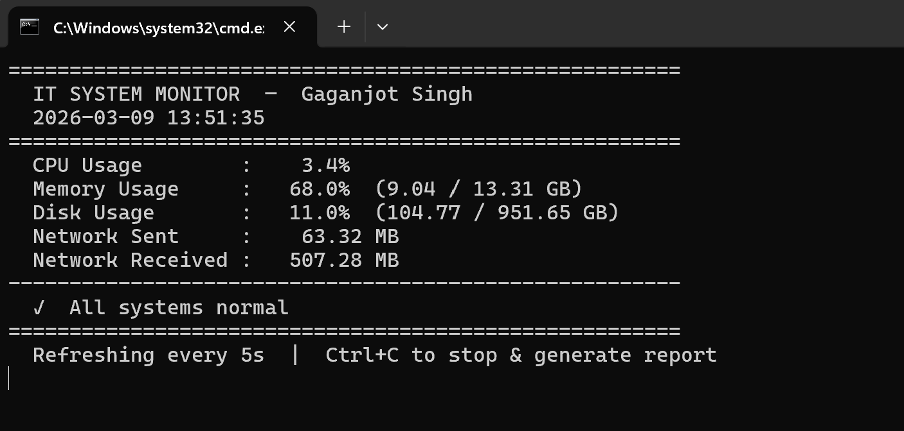

# 👨‍💻 Gaganjot Singh — IT Projects Portfolio

**IT Administrator & Developer | Gothenburg, Sweden**
📧 gagangill2626@gmail.com | 🔗 [LinkedIn](https://linkedin.com/in/gaganjot-singh-380807258)

---

## 🗂️ Projects

| # | Project | Description | Tech |
|---|---------|-------------|------|
| 1 | [IT System Monitor](./1_it_monitor/) | Real-time CPU/RAM/disk/network monitor with alert logging and HTML reports | Python, psutil |
| 2 | [Helpdesk Ticket System](./2_helpdesk/) | Jira-inspired CLI ticket manager with KPI reporting | Python |
| 3 | [Azure Automation Toolkit](./3_cloud_automation/) | Azure AD user provisioning, group management, compliance reporting | Python |

---

## 🛠️ Skills Demonstrated

- **System monitoring** — real-time metrics, threshold alerting, automated reporting
- **Incident management** — full ticket lifecycle, audit trails, KPI dashboards
- **Cloud administration** — user provisioning, access control, compliance checks
- **Python programming** — OOP, file I/O, JSON persistence, HTML generation, CLI design

---

## 📋 Background

4+ years of IT administration experience in a live logistics environment (C.H. Robinson, 100–500 weekly shipments).
Experienced with **Microsoft Azure**, **Active Directory**, **Jira Service Desk**, **Linux**, and **Microsoft Dynamics 365**.
Currently based in **Gothenburg, Sweden** — seeking Summer 2026 IT internship.

---
## System Monitor Output

Screenshot of the IT System Monitor running on Windows.



### Technologies Used


### Run the Project

```bash
pip install psutil
python monitor.py
```ends

*All projects run with Python 3.8+ and minimal or no external dependencies.*
